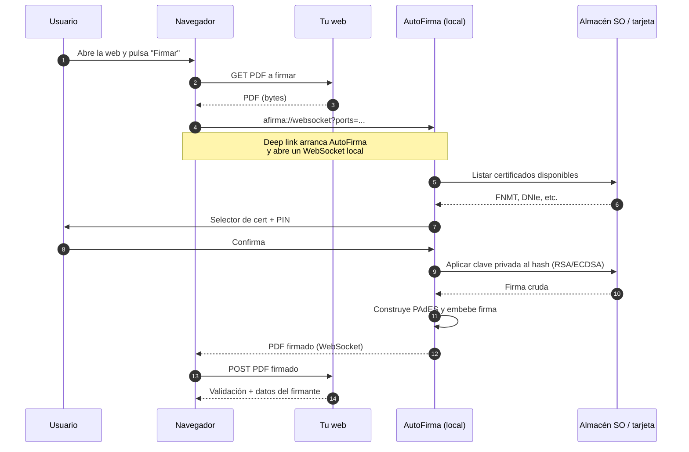
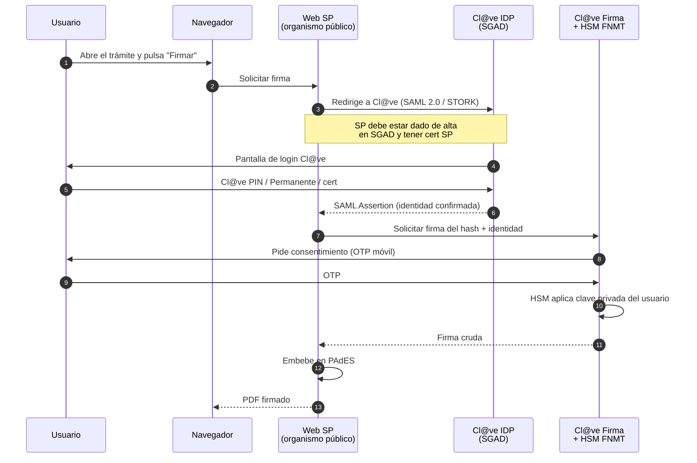
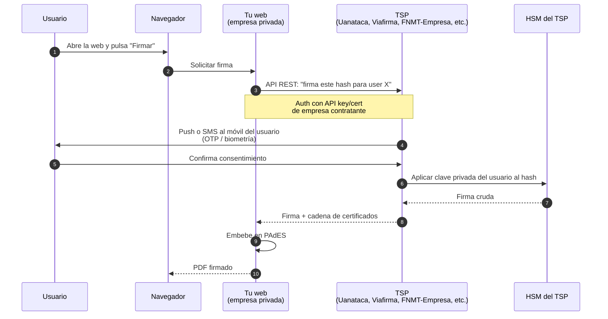

# Modelos de firma electrónica en España

Tres formas de firmar PDFs en web con valor legal (eIDAS) ordenadas por modelo:

- **A. Firma local con AutoFirma** — la clave privada vive en el dispositivo del usuario.
- **B. Cl@ve Firma** — firma centralizada en un HSM de la FNMT; solo para el sector público.
- **C. TSP comercial (firma en la nube)** — firma centralizada en un HSM de un Prestador Cualificado contratado por la empresa.

Todos producen firmas **cualificadas** (eIDAS QES) cuando se usa un certificado cualificado. Lo que cambia es **dónde vive la clave privada**, **quién custodia el HSM** y **qué requisitos contractuales/legales tiene quien integra el servicio**.

---

## Modelo A — AutoFirma (firma local)

La clave privada está en el certificado del usuario, instalado en su navegador, en una tarjeta criptográfica (DNIe, cert FNMT en tarjeta) o en un token USB. AutoFirma es la app de escritorio (Win/Mac/Linux) o móvil (iOS/Android) que media entre la web y el almacén de certificados del sistema operativo.

**Quién lo usa**: AEAT, Seguridad Social, casi toda la admin española. También cualquier empresa privada.

---

## Modelo B — Cl@ve Firma (firma centralizada del Estado)

La clave privada del ciudadano vive en un **HSM operado por la FNMT**. El ciudadano nunca la tiene físicamente; firma autenticándose con Cl@ve PIN o Cl@ve Permanente y autorizando la operación con OTP. **Solo organismos del Sector Público Administrativo Estatal pueden ser proveedores de servicios (SP) de Cl@ve**.

**Quién lo usa**: trámites en sede electrónica de AEAT, Seguridad Social, comunidades autónomas, ayuntamientos.

---

## Modelo C — TSP comercial (firma en la nube para privados)

Equivalente funcional a Cl@ve Firma pero ofrecido por un **Prestador Cualificado de Servicios de Confianza** (TSP) que figura en la **Lista Europea de Confianza eIDAS**. La empresa contrata al TSP, los usuarios se dan de alta en el TSP (presencialmente o por videoidentificación cumpliendo eIDAS), y firman desde la web de la empresa.

**Quién lo usa**: bancos, aseguradoras, gestorías, plataformas SaaS de contratación.

---

## Requisitos como empresa/organismo, comparativa

| Aspecto | A. AutoFirma | B. Cl@ve Firma | C. TSP comercial |
|---|---|---|---|
| **Quién puede integrar** | Cualquiera (privado y público) | Solo Sector Público Administrativo Estatal y entidades vinculadas con habilitación | Cualquier empresa privada o pública |
| **Contrato / convenio** | Ninguno | Convenio con SGAD (Mº Hacienda y Función Pública) | Contrato comercial con el TSP elegido |
| **Coste inicial** | 0 € | 0 € (cubierto por la admin) | Suele incluir alta + setup técnico (cientos-miles €) |
| **Coste recurrente** | 0 € | 0 € | Pago por firma (~0,20-2 €/firma) o suscripción mensual |
| **Cert/HSM propio del SP** | No necesario | Cert de sello del organismo + IP whitelisteada | API key o cert mTLS para autenticar a la API |
| **Tecnología de integración** | JS (`autoscript.js`) + protocol handler `afirma://` | SAML 2.0 (perfil STORK) + SOAP a WS de firma | REST/SOAP, varía por TSP (estándares: CSC / OASIS DSS) |
| **Pre-producción obligatoria** | No | Sí, pruebas en entorno SGAD antes de producción | Sí, sandbox del TSP |
| **Alta del usuario firmante** | El usuario obtiene su cert (FNMT, DNIe) por su cuenta | Registro Cl@ve presencial o videoidentificación oficial | Lo gestiona el TSP: presencial o videoidentificación cumpliendo eIDAS |
| **Custodia de la clave privada** | El usuario (su PC, tarjeta o token) | HSM FNMT | HSM del TSP |
| **UX en móvil** | App "Cliente Móvil @firma" / "AutoFirma" | Nativa (basta navegador + Cl@ve Móvil/PIN) | Nativa (basta navegador + push/OTP) |
| **Validez legal** | Cualificada si el cert lo es | Cualificada | Cualificada si el TSP emite certs cualificados |
| **Auditoría / cumplimiento** | Responsabilidad del SP | Auditoría del Estado | Auditoría TSP + responsabilidad propia del SP integrador |

## Cuándo elegir cada uno

- **A** si: producto interno, audiencia técnica o administrativa, presupuesto cero, OK con fricción de instalación.
- **B** si: eres organismo público con convenio con SGAD.
- **C** si: producto para público general, alta conversión importante, dispuesto a pagar por firma, quieres delegar custodia y compliance.

## TSPs cualificados en España (no exhaustivo)

- **FNMT-RCM** — "Firma en la Nube" para empresas (servicio comercial, distinto de Cl@ve).
- **Uanataca**, **ANF AC**, **Camerfirma** (MyCertificates), **Logalty**, **Lleida.net**, **Validated ID**, **Viafirma**, **Signaturit**, **Evicertia**.

Lista oficial actualizada: [Lista de Confianza Española eIDAS](https://sedeaplicaciones.minetur.gob.es/Prestadores/) y [Trusted List Browser](https://eidas.ec.europa.eu/efda/tl-browser/).
